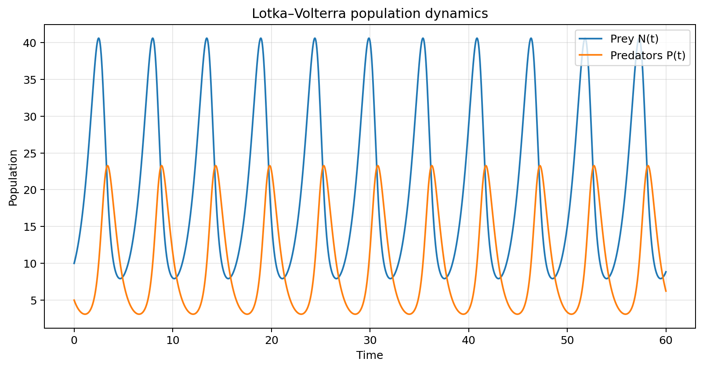
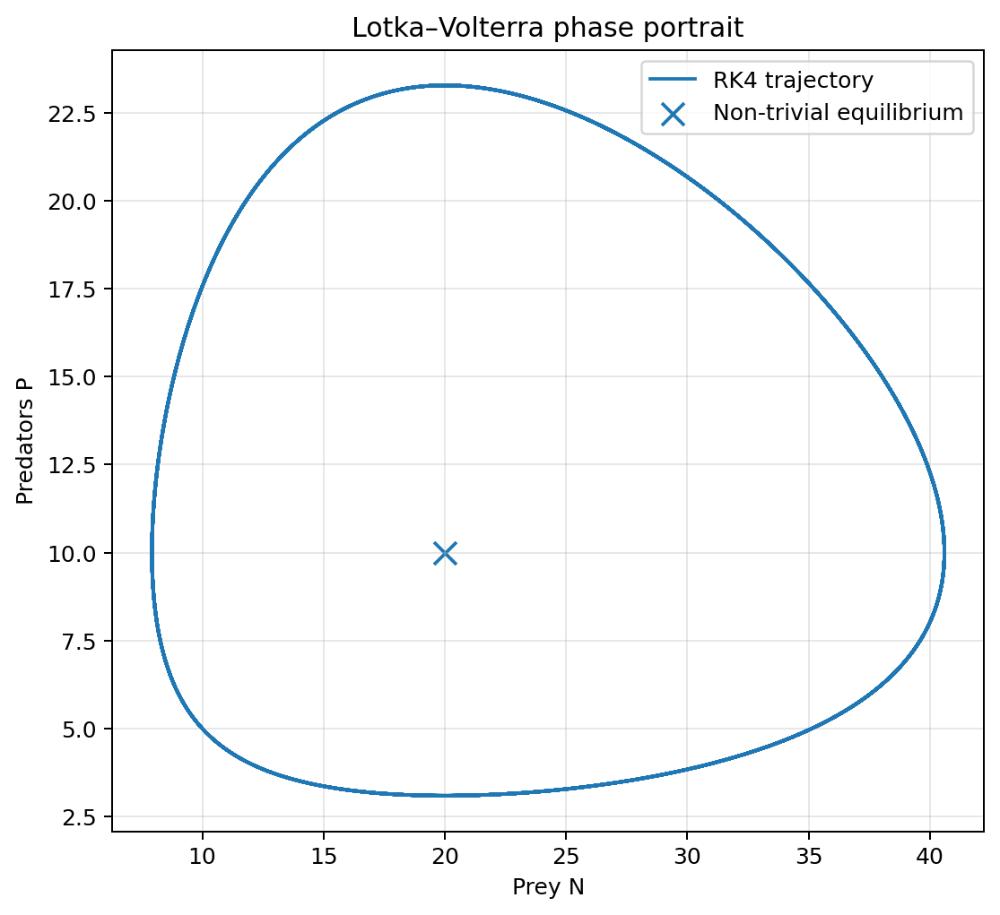
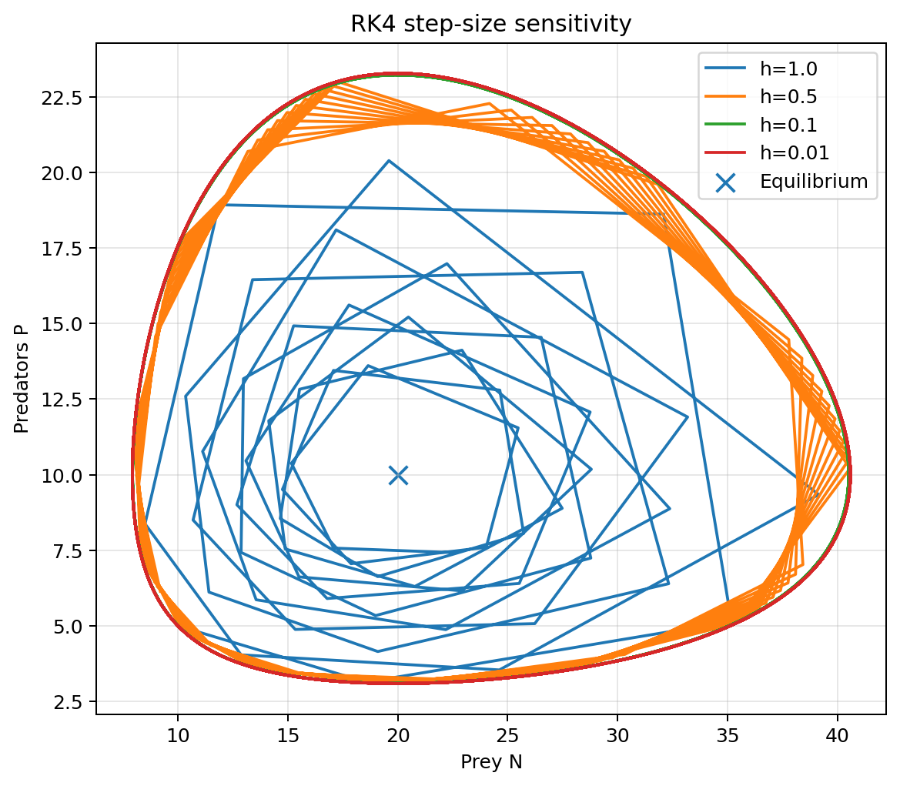
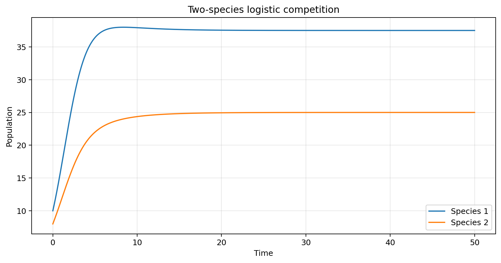
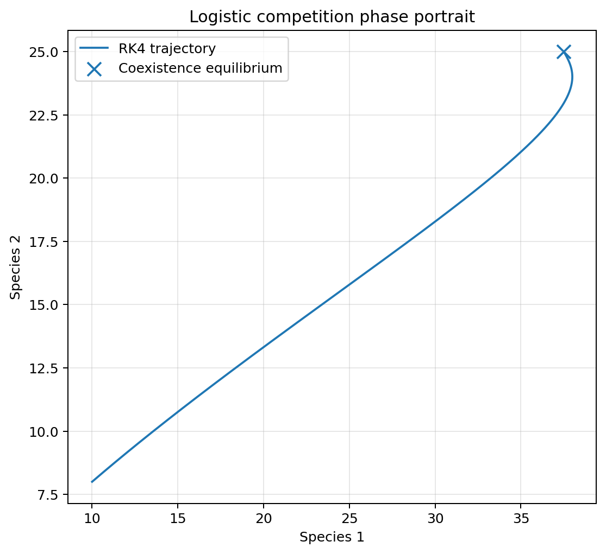
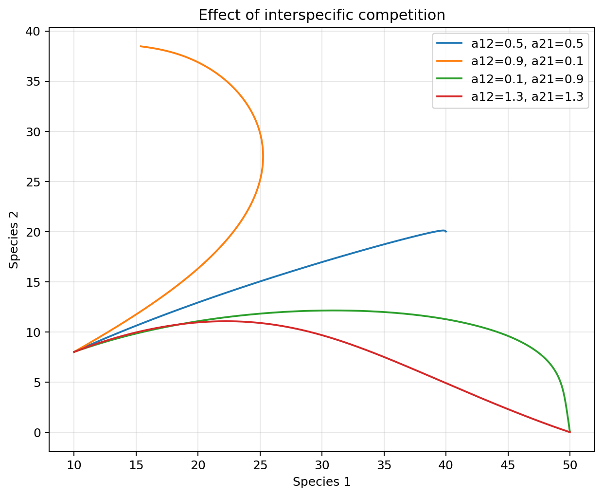

# Population Dynamics with RK4

Numerical and theoretical study of two classical nonlinear population models: the **Lotka–Volterra predator–prey system** and a **two-species logistic competition model**. The project was completed during GM3 at INSA Rouen Normandie and uses a hand-written fourth-order Runge–Kutta solver for the simulations.

## Project goals

- model predator–prey interactions with Lotka–Volterra equations;
- model interspecific competition with a two-species logistic system;
- implement the classical RK4 scheme from scratch;
- study phase portraits and equilibrium behaviour;
- analyze sensitivity to time step, initial conditions and model parameters;
- compare periodic predator–prey dynamics with convergence in the competition model.

## Mathematical models

### Lotka–Volterra predator–prey system

$$
\frac{dN}{dt}=rN-\alpha NP,
$$

$$
\frac{dP}{dt}=\beta NP-dP.
$$

The non-trivial equilibrium is

$$
E^*=\left(\frac{d}{\beta},\frac{r}{\alpha}\right).
$$

For the baseline parameters used in the project,

$$
E^*=(20,10).
$$

### Two-species logistic competition

$$
\frac{dN_1}{dt}=r_1N_1\left(1-\frac{N_1+a_{12}N_2}{K_1}\right),
$$

$$
\frac{dN_2}{dt}=r_2N_2\left(1-\frac{N_2+a_{21}N_1}{K_2}\right).
$$

When a unique interior coexistence equilibrium exists,

$$
N_{1}=\frac{K_{1}-a_{12}K_{2}}{1-a_{12}a_{21}},\qquad N_{2}=\frac{K_{2}-a_{21}K_{1}}{1-a_{12}a_{21}}
$$

With the baseline parameters of the project this gives

$$
\left(N_{1}^{*},N_{2}^{*}\right)=(37.5,25)
$$

## Numerical method: RK4

For an ODE $y'=f(t,y)$ and a time step $h$, the classical fourth-order Runge–Kutta scheme is

$$
k_1=f(t_n,y_n),
$$

$$
k_2=f\left(t_n+\frac{h}{2},y_n+\frac{h}{2}k_1\right),
$$

$$
k_3=f\left(t_n+\frac{h}{2},y_n+\frac{h}{2}k_2\right),
$$

$$
k_4=f(t_n+h,y_n+hk_3),
$$

$$
y_{n+1}=y_n+\frac{h}{6}\left(k_1+2k_2+2k_3+k_4\right).
$$

The implementation is contained in `src/population_dynamics/rk4.py`.

## Results

### Lotka–Volterra dynamics



The prey and predator populations exhibit the expected oscillatory behaviour, with predator peaks lagging behind prey peaks.



The numerical trajectory forms a closed orbit around the non-trivial equilibrium.

### Influence of the time step



The simulations illustrate how larger time steps distort the numerical trajectory, while the solutions stabilize as the discretization is refined.

### Logistic competition model



For the baseline parameters, the two populations converge toward a coexistence equilibrium rather than oscillating indefinitely.



### Competition sensitivity



Changing the interspecific competition coefficients modifies the transient dynamics and can move the system toward coexistence or competitive exclusion regimes.

## Repository structure

```text
population-dynamics-rk4/
├── src/population_dynamics/
│   ├── models.py
│   ├── rk4.py
│   └── experiments.py
├── scripts/
│   └── generate_figures.py
├── tests/
│   └── test_models.py
├── results/
│   └── figures/
├── notebooks/
│   └── original_analysis.ipynb
├── docs/
│   └── report.pdf
├── main.py
├── Makefile
├── requirements.txt
└── README.md
```

## Installation

```bash
python3 -m venv .venv
source .venv/bin/activate
pip install -r requirements.txt
```

## Run the simulations

Lotka–Volterra:

```bash
python3 main.py --model lotka
```

Two-species logistic competition:

```bash
python3 main.py --model logistic
```

A different RK4 step size can be supplied with `--h`:

```bash
python3 main.py --model lotka --h 0.05
```

## Regenerate the figures

```bash
make figures
```

## Run the tests

```bash
make test
```

The tests verify the RK4 implementation on a known exponential ODE and check the analytical/numerical equilibrium behaviour of the logistic model.

## Original academic material

The original Jupyter notebook is preserved in `notebooks/original_analysis.ipynb`, while the full project report is available in `docs/report.pdf`.

## Authors

- Manh Hung Nguyen
- Tan Minh Duy Ngo

GM3 — INSA Rouen Normandie.
